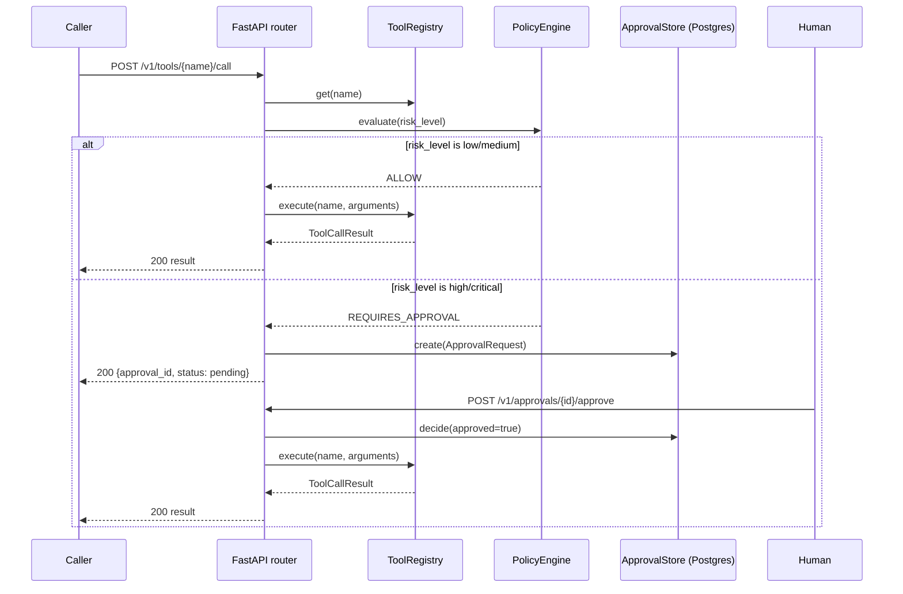
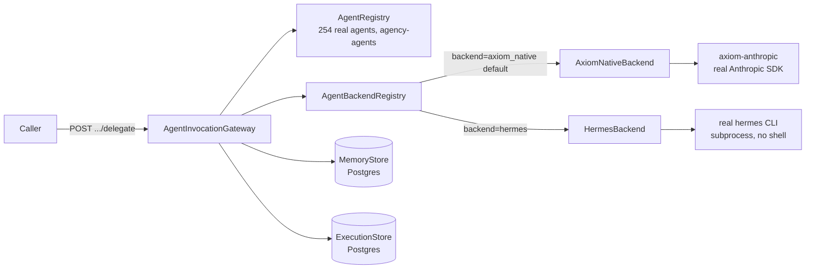
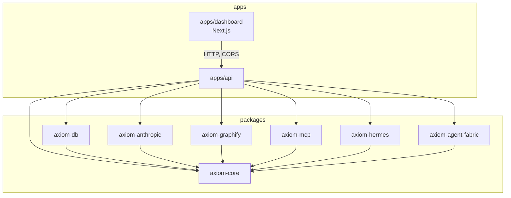

# Axiom OS — Architecture

Axiom OS is a control plane for agentic AI: a real FastAPI service that
routes work to real model/agent/knowledge backends through a small set of
provider-neutral abstractions, gates risky actions behind a real human
approval workflow, and records what actually happened. This document
describes what's actually built, grounded in the real package layout —
see `docs/IMPLEMENTATION_PLAN.md` for the full per-milestone history of
how it got this way, including every real bug found along the way.

## Design principle: control plane vs. execution plane

Every external integration (Anthropic, Graphify, Hermes, any MCP server)
follows the same shape: `packages/axiom-core` defines a provider-neutral
`Protocol` (an interface with no concrete SDK dependency), and a small
adapter package implements it against one real SDK/CLI/server. `axiom-core`
never imports `anthropic`, `mcp`, or any concrete client — it only knows
the shape of a `ModelBackend`, `KnowledgeBackend`, `AgentBackend`,
`MemoryStore`, `ApprovalStore`, `ExecutionStore`, or `ToolHandler`.

```
axiom-core (Protocols only, no concrete SDK deps)
  ├── axiom-anthropic   implements ModelBackend  (real Anthropic SDK)
  ├── axiom-graphify    implements KnowledgeBackend (real Graphify MCP)
  ├── axiom-hermes      implements AgentBackend  (real Hermes CLI)
  ├── axiom-mcp         generic MCP client -> ToolRegistry integration
  ├── axiom-db          implements MemoryStore/ApprovalStore/
  │                     ExecutionStore (real Postgres/Supabase)
  └── axiom-agent-fabric  Agent Registry + Invocation Gateway over the
                          agency-agents persona library
```

`apps/api` is the only place all of these are wired together — its
FastAPI `lifespan` (`apps/api/axiom_api/main.py`) is the single
composition root: it builds every registry/store once at startup and
hands them out via `Depends()`. Nothing downstream imports a concrete
adapter directly; every router only depends on the `axiom-core` Protocol.

## Request lifecycle

A tool call that turns out to be high-risk exercises the whole system —
this is the real path (`apps/api/axiom_api/routers/tools.py` +
`routers/approvals.py`), not an idealized one:



Every call through `ToolRegistry.execute()` — either branch — logs a
structured `axiom.tool.audit` line (tool name, risk level, permission
check outcome, duration, status). See `docs/security/SECURITY_AUDIT.md`
§1 for the real, load-bearing detail here: the approval gate is enforced
by the router calling `PolicyEngine.evaluate()` *before* calling
`execute()`, not inside the registry itself. That's a deliberate
control-plane/execution-plane split, not an oversight — but it means any
future caller of `ToolRegistry.execute()` must remember to go through
policy first; nothing in the registry itself would stop it otherwise.

## Agent delegation



`AgentInvocationGateway` (`packages/axiom-agent-fabric/axiom_agent_fabric/gateway.py`)
looks an agent up by id in the curated `AgentRegistry`, picks a backend
(defaulting to `axiom_native`, or `hermes` if the caller asks for it),
runs the task, and persists both a `MemoryRecord` (source
`execution:{id}`) and an `ExecutionRow` for every real invocation — this
is what makes `/v1/observability/*` and the Dashboard's Executions view
real rather than synthetic.

## Package dependency graph



Only `apps/api` and `apps/dashboard` know about all the pieces at once;
every `packages/*` implementation package depends on `axiom-core` and
nothing else in the workspace.

## What's deliberately not built (v1 scope)

- **Agent Graph / Knowledge Graph visualization** (CLAUDE.md §41/§42): a
  rendered graph of "what did the agents do" and "what's connected to
  what" was a stated aspiration, not built. What *is* real: flat,
  queryable execution traces (`ExecutionStore`, `/v1/observability/*`,
  the Dashboard's Executions table) and Graphify's own knowledge graph
  (queried, not visualized, by Axiom). Correlating the two (§43) is not
  implemented.
- **Docker / deployment infrastructure**: `infrastructure/docker/` exists
  as an empty placeholder directory — no Dockerfile or compose file was
  written. Local dev only (`uv run`, `npm run dev`).
- **Auth layer, multi-tenant knowledge partitioning**: named as real, open
  gaps in `docs/security/SECURITY_AUDIT.md` — not silently assumed done.
  (Budget enforcement and bounded agent-to-agent delegation *are* built —
  see `SECURITY.md`.)
- **Model-initiated agent-to-agent delegation**: the `delegate_to_agent`
  native tool lets a caller have one agent delegate to another with a
  real depth cap, but `AxiomNativeBackend` has no tool-calling loop, so
  no agent's own reasoning can invoke it autonomously yet — see
  `docs/security/SECURITY_AUDIT.md` §11.

## Where to go deeper

| Topic | Document |
|---|---|
| Full milestone-by-milestone build history, every real bug and fix | `docs/IMPLEMENTATION_PLAN.md` |
| Security posture — what's enforced, what's a named gap | `SECURITY.md` / `docs/security/SECURITY_AUDIT.md` |
| Hermes CLI integration, real install gotchas | `HERMES_INTEGRATION.md` / `docs/hermes/HERMES_INTEGRATION.md` |
| Graphify MCP integration, verified tool schemas | `GRAPHIFY_INTEGRATION.md` / `docs/graphify/GRAPHIFY_AUDIT.md` |
| Agent Fabric — 254 real agents, curation, normalization | `AGENT_FABRIC.md` / `docs/agent-fabric/AGENT_LIBRARY_AUDIT.md` |
| Knowledge Gateway abstraction | `KNOWLEDGE_FABRIC.md` |
| Evaluation methodology and last real benchmark result | `EVALUATION.md` |
| Live, interactive API reference | `http://127.0.0.1:8000/docs` (Swagger UI, auto-generated by FastAPI) while the API is running |
